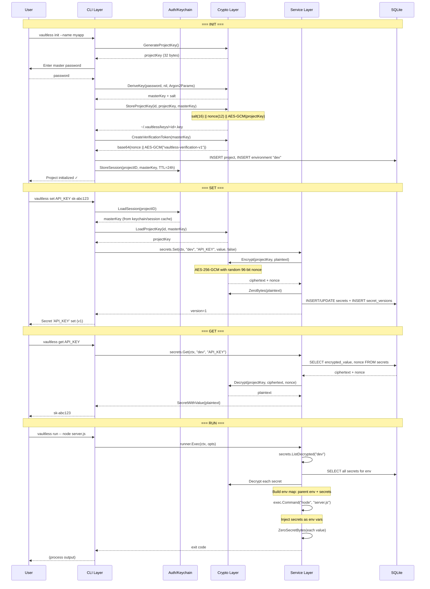
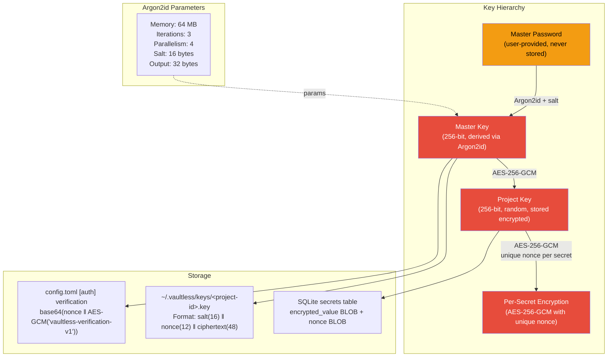
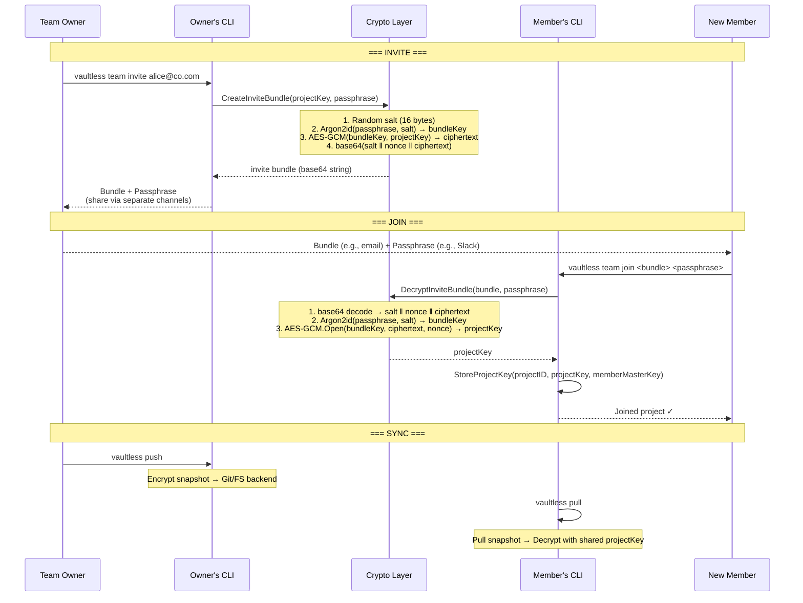
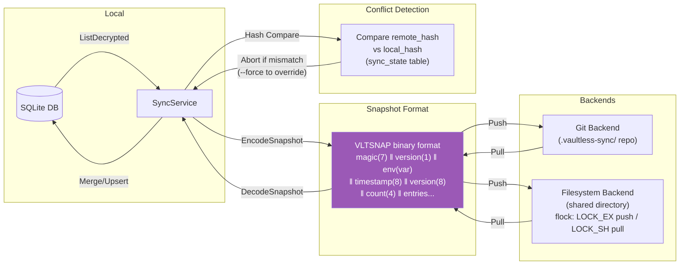
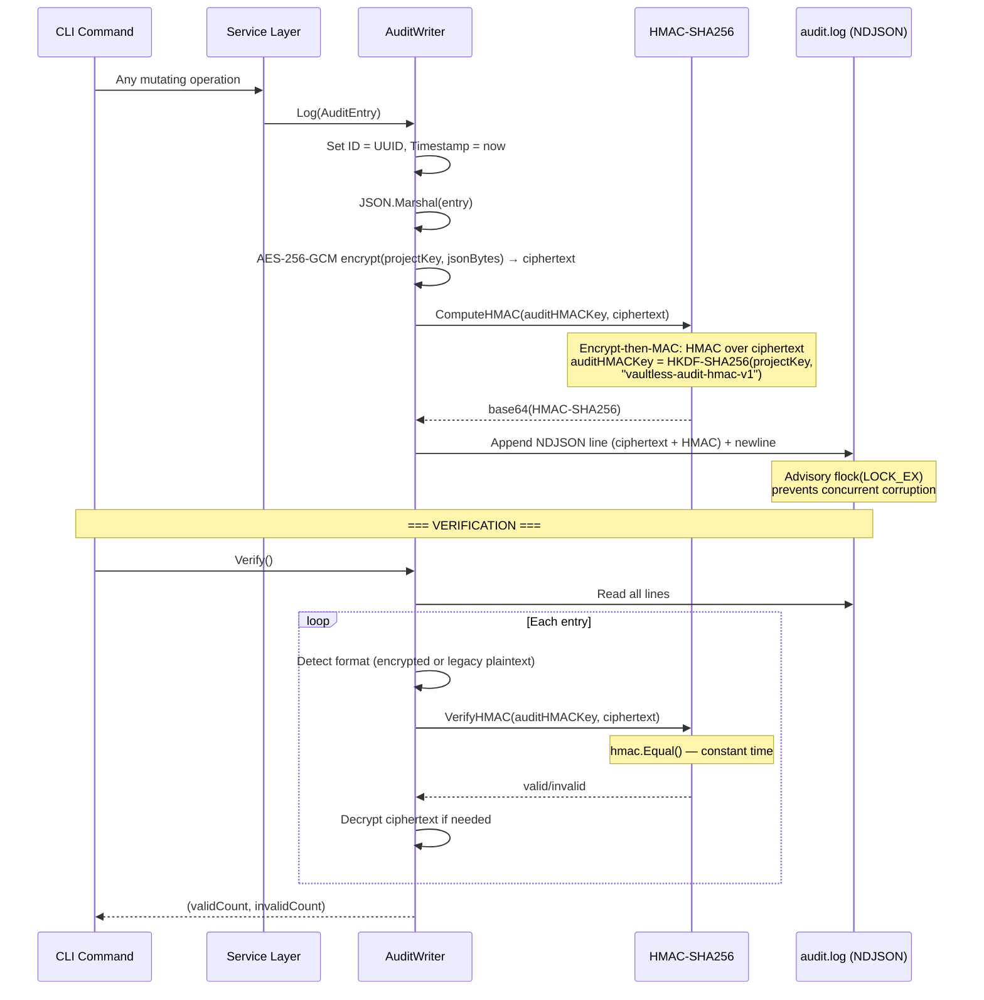
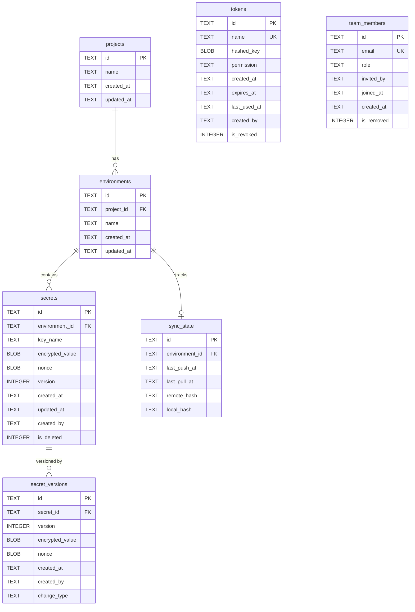
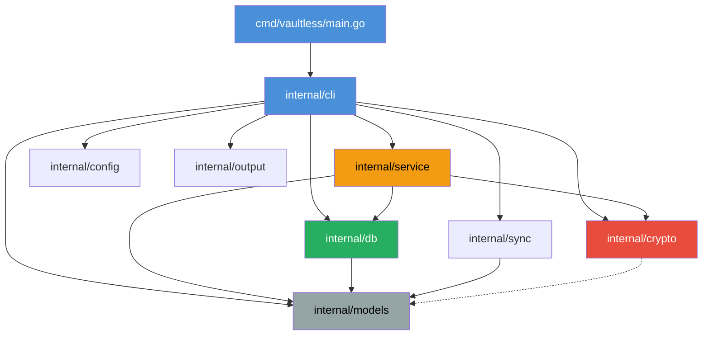

# Vaultless: Comprehensive Technical Guide

> **Version:** 1.0 &middot; **License:** AGPL-3.0 &middot; **Language:** Go 1.22+

---

## Table of Contents

1. [Executive Summary](#1-executive-summary)
2. [Architecture Overview](#2-architecture-overview)
3. [Security Model](#3-security-model)
4. [Database Schema](#4-database-schema)
5. [Command Reference](#5-command-reference)
6. [Code Organization](#6-code-organization)
7. [Build & Deployment](#7-build--deployment)
8. [API / Service Layer](#8-api--service-layer)
9. [Testing Strategy](#9-testing-strategy)
10. [Future Roadmap](#10-future-roadmap)

---

## 1. Executive Summary

### What Is Vaultless?

Vaultless is an **offline-first, zero-dependency secrets management CLI** that replaces `.env` files with encrypted, versioned, and syncable secrets — shipped as a single binary with no external services required.

### Why It Exists

| Problem | Vaultless Solution |
|---|---|
| `.env` files committed to Git | Secrets stored in encrypted SQLite, never plaintext on disk |
| Cloud vault vendor lock-in | Fully local, optional sync via Git or filesystem |
| Heavy infrastructure (Vault, AWS SM) | Single 14 MB binary, zero setup |
| No audit trail for `.env` changes | Encrypted NDJSON audit log with HMAC tamper detection (encrypt-then-MAC) |
| No environment separation in `.env` | First-class environment support (dev/staging/prod) |
| Sharing secrets over Slack/email | Encrypted team invite bundles with passphrase |

### Key Differentiators

- **Single binary** — No Docker, no server, no cloud account. `curl | sh` and go.
- **Offline-first** — All operations work without internet. Sync is opt-in.
- **Envelope encryption** — 3-level key hierarchy (master key &rarr; project key &rarr; per-secret DEK via AES-256-GCM nonces).
- **Pure Go / No CGo** — Cross-compiles to Linux, macOS, Windows (amd64/arm64) with no native dependencies. Uses `modernc.org/sqlite`.
- **Version history & rollback** — Every secret change is versioned. Roll back to any prior version.
- **Encrypted audit logs** — Every operation is encrypted (AES-256-GCM) and HMAC-signed (encrypt-then-MAC) for confidentiality and tamper evidence.
- **CI/CD tokens** — Scoped, expirable tokens for non-interactive access (read-only or read-write).

### Target Users

| Persona | Use Case |
|---|---|
| Solo developer | Replace `.env` files with encrypted, versioned secrets |
| Startup team (2–15) | Share secrets securely without Slack/email, sync via Git |
| DevOps engineer | CI/CD token integration, audit compliance, backup/restore |
| Security-conscious org | Encryption at rest, tamper-evident audit trail, key rotation |

---

## 2. Architecture Overview

### 2.1 System Architecture

Vaultless follows a **layered monolith** pattern — a single binary with clean package boundaries acting as layers.

```mermaid
graph TB
    subgraph "User Interface Layer"
        CLI["CLI Commands<br/>(internal/cli)"]
        Flags["Global Flags<br/>--env, --json, --quiet, --force"]
    end

    subgraph "Service Layer (Business Logic)"
        SecSvc["SecretsService"]
        EnvSvc["EnvironmentsService"]
        AuditSvc["AuditWriter"]
        TeamSvc["TeamService"]
        TokenSvc["TokensService"]
        RunSvc["Runner"]
        SyncSvc["SyncService"]
        BackupSvc["BackupService"]
        DoctorSvc["DoctorService"]
        ImportSvc["Importer"]
        ExportSvc["Exporter"]
    end

    subgraph "Data Access Layer"
        DB["SQLite via modernc.org/sqlite<br/>(internal/db)"]
        AuditFile["Audit Log File<br/>NDJSON + HMAC"]
        KeyFiles["Key Files<br/>~/.vaultless/keys/"]
        ConfigFiles["Config Files<br/>TOML"]
    end

    subgraph "Cryptography Layer"
        AES["AES-256-GCM<br/>Encrypt/Decrypt"]
        Argon2["Argon2id<br/>Key Derivation"]
        HMAC["HMAC-SHA256<br/>Audit Signing"]
        NaCl["NaCl/X25519<br/>Team Key Exchange"]
        KC["Keychain<br/>Session Cache"]
        Rand["crypto/rand<br/>UUID, Nonce, Salt"]
        Zero["Memory Zeroing"]
    end

    subgraph "Sync Layer"
        SyncBackend["SyncBackend Interface"]
        GitBackend["Git Backend"]
        FSBackend["Filesystem Backend<br/>flock: LOCK_EX/LOCK_SH"]
    end

    CLI --> SecSvc & EnvSvc & AuditSvc & TeamSvc & TokenSvc & RunSvc & SyncSvc & BackupSvc & DoctorSvc & ImportSvc & ExportSvc
    SecSvc & EnvSvc & TokenSvc & TeamSvc --> DB
    SecSvc --> AES
    AuditSvc --> AuditFile & HMAC
    TeamSvc --> NaCl
    RunSvc --> SecSvc
    SyncSvc --> SyncBackend
    SyncBackend --> GitBackend & FSBackend
    CLI --> KC & Argon2

    style CLI fill:#4a90d9,color:#fff
    style AES fill:#e74c3c,color:#fff
    style Argon2 fill:#e74c3c,color:#fff
    style HMAC fill:#e74c3c,color:#fff
    style DB fill:#27ae60,color:#fff
```



### 2.2 Data Flow: init &rarr; set &rarr; get &rarr; run



### 2.3 Encryption / Decryption Flow



**Encryption (Set):**
```
plaintext → AES-256-GCM(projectKey, plaintext, randomNonce) → (ciphertext, nonce)
         → ZeroBytes(plaintext)
         → Store ciphertext + nonce in SQLite
```

**Decryption (Get):**
```
(ciphertext, nonce) from SQLite → AES-256-GCM.Open(projectKey, ciphertext, nonce) → plaintext
```

### 2.4 Team Sync Architecture



### 2.5 Sync Protocol (Push/Pull)



### 2.6 Audit Trail Flow



---

## 3. Security Model

### 3.1 Threat Model

| Threat | Mitigation |
|---|---|
| **Disk theft / forensic recovery** | All secrets encrypted with AES-256-GCM. Project key encrypted by master key. Plaintext never written to disk. |
| **Brute-force master password** | Argon2id with 64 MB memory, 3 iterations — expensive to parallelize on GPUs/ASICs. |
| **Memory dump / core dump** | Core dumps disabled at startup (`RLIMIT_CORE = 0`). Sensitive buffers zeroed after use via `ZeroBytes()`. `umask(0077)` enforced. |
| **Audit log tampering** | Each entry encrypted with AES-256-GCM and signed with HMAC-SHA256 over the ciphertext (encrypt-then-MAC). Verification detects any modification, deletion, or insertion. |
| **Man-in-the-middle (team sync)** | Invite bundles encrypted with Argon2id-derived key from passphrase. Passphrase shared out-of-band. |
| **Token theft (CI/CD)** | Tokens stored as SHA-256 hashes. Scoped permissions (read-only/read-write). Expirable. `is_revoked` flag in `tokens` table enables immediate revocation; `Validate()` checks revocation status before returning and returns 401 if revoked. |
| **Compromised sync remote** | Sync snapshots contain already-encrypted data. Compromise of Git remote does not expose plaintext. |
| **Swap / temp file leakage** | Temp `.env` files written with `0600` permissions and cleaned up on exit/signal. |
| **Dependency supply chain** | Pure Go, no CGo. Minimal dependency tree. SBOM generated for releases. |

### 3.2 Encryption: AES-256-GCM

All secret values are encrypted using **AES-256-GCM** (Galois/Counter Mode):

| Property | Value |
|---|---|
| Algorithm | AES-256-GCM (NIST SP 800-38D) |
| Key size | 256 bits (32 bytes) |
| Nonce size | 96 bits (12 bytes) per NIST recommendation |
| Nonce generation | `crypto/rand` — unique per encryption operation |
| Auth tag | 128 bits (embedded in ciphertext by Go's GCM implementation) |
| Authenticated data | None (AAD not used) |

**Properties provided:**
- **Confidentiality** — AES-256 encryption
- **Integrity** — GCM authentication tag detects any ciphertext modification
- **Authenticity** — Only holders of the project key can produce valid ciphertext

**Implementation** (`internal/crypto/aes.go`):
```go
func Encrypt(key, plaintext []byte) (ciphertext, nonce []byte, err error)
func Decrypt(key, ciphertext, nonce []byte) (plaintext []byte, err error)
```

### 3.3 Key Hierarchy

```
Master Password (user memory only, never persisted)
    │
    ├── Argon2id(password, salt) ──► Master Key (256-bit)
    │       │
    │       ├── AES-GCM(masterKey, projectKey) ──► Encrypted Project Key File
    │       │                                       ~/.vaultless/keys/<id>.key
    │       │                                       Format: salt(16) ‖ nonce(12) ‖ ciphertext(48)
    │       │
    │       └── AES-GCM(masterKey, "vaultless-verification-v1") ──► Verification Token
    │                                                                Stored in .vaultless/config.toml
    │
    └── Project Key (256-bit, random)
            │
            ├── AES-GCM(projectKey, secretValue) ──► Per-secret encryption
            │                                        Stored in SQLite (ciphertext + nonce)
            │
            ├── HKDF-SHA256(projectKey, "vaultless-audit-hmac-v1") ──► Audit HMAC Key
            │                                                          Signs each audit entry
            │
            └── Argon2id(passphrase, salt) ──► Bundle Key (for team invites)
                    AES-GCM(bundleKey, projectKey) ──► Invite Bundle
```

**Key lifecycle:**
1. **Generation:** `init` creates a random 256-bit project key
2. **Protection:** Project key encrypted by master key, stored in `~/.vaultless/keys/<id>.key`
3. **Caching:** Master key cached in OS keychain (or encrypted fallback file) with 24h TTL
4. **Team sharing:** Project key shared via Argon2id-encrypted invite bundle
5. **Rotation:** `RotateProjectKey()` generates a fresh 256-bit project key, re-encrypts all secrets under the new key within a transaction, pushes a signed rotation event to the sync backend, and distributes the new key to team members via invite bundles. A version history of key rotations is maintained for auditability.

### 3.4 Argon2id Key Derivation

The master password is never stored — it is transformed into a master key using **Argon2id** (RFC 9106, the recommended Argon2 variant):

| Parameter | Production Value | Test Value |
|---|---|---|
| Memory | 64 MB (`64 * 1024` KiB) | 1 MB |
| Iterations (time cost) | 3 | 1 |
| Parallelism (lanes) | 4 | 1 |
| Salt length | 16 bytes (random) | 16 bytes |
| Output key length | 32 bytes (256 bits) | 32 bytes |

**Why Argon2id:**
- Memory-hard — resists GPU/ASIC brute-force attacks
- Hybrid mode (id) — resists both side-channel and GPU attacks
- Winner of the Password Hashing Competition (2015)
- Recommended by OWASP for password hashing

**Salt storage:** The salt is stored in the project config file (`.vaultless/config.toml` under `[auth].salt`) and in the key file header. A new random salt is generated per project initialization.

### 3.5 HMAC Signing (Audit Integrity)

Audit log entries use an **encrypt-then-MAC** scheme: each entry is first encrypted with **AES-256-GCM** using the project key, then an **HMAC-SHA256** is computed over the ciphertext. This provides both confidentiality (entries are not readable without the project key) and tamper evidence (the HMAC detects any modification). The reader is backwards compatible with legacy plaintext entries.

```
auditHMACKey = HKDF-SHA256(projectKey, info="vaultless-audit-hmac-v1")
entryJSON    = JSON.Marshal(entry)
ciphertext   = AES-256-GCM(projectKey, entryJSON)
signature    = HMAC-SHA256(auditHMACKey, ciphertext)
output       = NDJSON line with ciphertext + base64(signature)
```

**Verification** uses `crypto/hmac.Equal()` for constant-time comparison, preventing timing attacks.

**What HKDF provides:** Domain separation — the audit HMAC key is cryptographically derived from the project key but is distinct, so compromise of the HMAC key does not reveal the project key.

### 3.6 Memory Zeroing

Sensitive data (master keys, project keys, plaintext secrets) is zeroed after use:

```go
// internal/crypto/zeroing.go
func ZeroBytes(b []byte) {
    for i := range b { b[i] = 0 }
}

type SecureBuffer struct { Data []byte }
// Use with defer: defer buf.Zero()
```

Additional hardening at startup (`securityInit()`):
- `RLIMIT_CORE` set to 0 — prevents core dumps containing key material
- `umask(0077)` — all new files are owner-only by default

### 3.7 Session Caching (Keychain)

To avoid re-prompting for the master password on every command:

| Method | Platform | Storage |
|---|---|---|
| OS Keychain | macOS (Keychain), Linux (Secret Service/kwallet), Windows (Credential Manager) | Managed by OS |
| Fallback (encrypted file) | Any | `~/.vaultless/sessions/` encrypted with machine key |

**Fallback machine key derivation:**
```
machineKey = SHA-256(machine-id ‖ username ‖ "vaultless-session")
```
Where `machine-id` comes from `/etc/machine-id` (Linux) or hostname as fallback.

**Session data** is JSON containing `project_id`, `master_key`, `created_at`, and `expires_at` (default 24h TTL). Expired sessions are automatically deleted.

### 3.8 What's Encrypted Where

| Data | Location | Encryption | Key |
|---|---|---|---|
| Secret values | SQLite `secrets.encrypted_value` + `secrets.nonce` | AES-256-GCM | Project key |
| Secret version values | SQLite `secret_versions.encrypted_value` + `nonce` | AES-256-GCM | Project key |
| Project key (at rest) | `~/.vaultless/keys/<id>.key` | AES-256-GCM | Master key |
| Verification token | `.vaultless/config.toml` `[auth].verification` | AES-256-GCM | Master key |
| Session/master key cache | OS keychain or `~/.vaultless/sessions/` | OS keychain or AES-256-GCM | OS-managed or machine key |
| Team invite bundle | Transmitted out-of-band (base64 string) | AES-256-GCM | Argon2id(passphrase) |
| Audit log entries | `.vaultless/audit.log` (NDJSON) | AES-256-GCM + HMAC over ciphertext (encrypt-then-MAC) | Project key (encryption) + Audit HMAC key (integrity) |
| Secret key names | SQLite `secrets.key_name` | **Not encrypted** (plaintext) | — |
| Environment names | SQLite `environments.name` | **Not encrypted** (plaintext) | — |
| CI/CD tokens | SQLite `tokens.hashed_key` | SHA-256 hash (one-way) | — |

---

## 4. Database Schema

Vaultless uses **SQLite** (via `modernc.org/sqlite`, a pure-Go implementation) with WAL mode.

### 4.1 Database Pragmas

```sql
PRAGMA journal_mode = WAL;         -- Write-Ahead Logging for concurrent reads
PRAGMA synchronous = NORMAL;       -- Balance between safety and performance
PRAGMA foreign_keys = ON;          -- Enforce referential integrity
PRAGMA busy_timeout = 5000;        -- 5s retry on lock contention
PRAGMA cache_size = -2000;         -- 2000 pages (~8 MB) in-memory cache
PRAGMA auto_vacuum = INCREMENTAL;  -- Reclaim space incrementally
PRAGMA temp_store = MEMORY;        -- Temp tables in memory
```

### 4.2 Entity-Relationship Diagram



### 4.3 Table Details

#### `projects`
Primary entity. One row per initialized project.

| Column | Type | Constraints | Description |
|---|---|---|---|
| `id` | TEXT | PRIMARY KEY | UUIDv4 |
| `name` | TEXT | NOT NULL | Human-readable project name |
| `created_at` | TEXT | NOT NULL | ISO 8601 timestamp |
| `updated_at` | TEXT | NOT NULL | ISO 8601 timestamp |

#### `environments`
Named partitions within a project (e.g., `dev`, `staging`, `prod`).

| Column | Type | Constraints | Description |
|---|---|---|---|
| `id` | TEXT | PRIMARY KEY | UUIDv4 |
| `project_id` | TEXT | FK &rarr; projects(id), NOT NULL | Parent project |
| `name` | TEXT | NOT NULL, UNIQUE(project_id, name) | Lowercase name |
| `created_at` | TEXT | NOT NULL | ISO 8601 |
| `updated_at` | TEXT | NOT NULL | ISO 8601 |

#### `secrets`
Current state of each secret. Values are always encrypted.

| Column | Type | Constraints | Description |
|---|---|---|---|
| `id` | TEXT | PRIMARY KEY | UUIDv4 |
| `environment_id` | TEXT | FK &rarr; environments(id), NOT NULL | Parent environment |
| `key_name` | TEXT | NOT NULL, UNIQUE(environment_id, key_name) | `^[A-Z][A-Z0-9_]*$` |
| `encrypted_value` | BLOB | NOT NULL | AES-256-GCM ciphertext + auth tag |
| `nonce` | BLOB | NOT NULL | 12-byte GCM nonce |
| `version` | INTEGER | NOT NULL, DEFAULT 1 | Current version number |
| `created_at` | TEXT | NOT NULL | ISO 8601 |
| `updated_at` | TEXT | NOT NULL | ISO 8601 |
| `created_by` | TEXT | | User identity |
| `is_deleted` | INTEGER | NOT NULL, DEFAULT 0 | Soft-delete flag |

#### `secret_versions`
Immutable history of every secret change.

| Column | Type | Constraints | Description |
|---|---|---|---|
| `id` | TEXT | PRIMARY KEY | UUIDv4 |
| `secret_id` | TEXT | FK &rarr; secrets(id), NOT NULL | Parent secret |
| `version` | INTEGER | NOT NULL, UNIQUE(secret_id, version) | Version number |
| `encrypted_value` | BLOB | NOT NULL | Encrypted value at this version |
| `nonce` | BLOB | NOT NULL | Nonce for this version |
| `created_at` | TEXT | NOT NULL | ISO 8601 |
| `created_by` | TEXT | | User identity |
| `change_type` | TEXT | NOT NULL | `created`, `updated`, `deleted`, `restored` |

#### `sync_state`
Tracks synchronization state per environment. The `remote_hash` and `local_hash` columns are used for **conflict detection**: before a pull, the sync service compares these hashes and aborts with a diff if they differ, requiring the `--force` flag to override.

| Column | Type | Constraints | Description |
|---|---|---|---|
| `id` | TEXT | PRIMARY KEY | UUIDv4 |
| `environment_id` | TEXT | FK &rarr; environments(id), NOT NULL | Tracked environment |
| `last_push_at` | TEXT | | Last push timestamp |
| `last_pull_at` | TEXT | | Last pull timestamp |
| `remote_hash` | TEXT | | Hash of last known remote state (used for conflict detection) |
| `local_hash` | TEXT | | Hash of local state at last sync (compared against remote_hash before pull) |

#### `tokens`
CI/CD access tokens with scoped permissions.

| Column | Type | Constraints | Description |
|---|---|---|---|
| `id` | TEXT | PRIMARY KEY | UUIDv4 |
| `name` | TEXT | NOT NULL, UNIQUE | Human-readable token name |
| `hashed_key` | BLOB | NOT NULL | SHA-256(token_key) — one-way |
| `permission` | TEXT | NOT NULL, DEFAULT 'read-only' | `read-only` or `read-write` |
| `created_at` | TEXT | NOT NULL | ISO 8601 |
| `expires_at` | TEXT | | Optional expiry (ISO 8601) |
| `last_used_at` | TEXT | | Last usage timestamp |
| `created_by` | TEXT | | Creator identity |
| `is_revoked` | INTEGER | NOT NULL, DEFAULT 0 | Revocation flag |

#### `team_members`
Team membership tracking.

| Column | Type | Constraints | Description |
|---|---|---|---|
| `id` | TEXT | PRIMARY KEY | UUIDv4 |
| `email` | TEXT | NOT NULL, UNIQUE | Member email |
| `role` | TEXT | NOT NULL, DEFAULT 'member' | `owner` or `member` |
| `invited_by` | TEXT | | Inviter identity |
| `joined_at` | TEXT | | Join timestamp (null = pending) |
| `created_at` | TEXT | NOT NULL | Invite creation timestamp |
| `is_removed` | INTEGER | NOT NULL, DEFAULT 0 | Removal flag |

### 4.4 Indexes

```sql
CREATE INDEX idx_secrets_env_key ON secrets(environment_id, key_name);
CREATE INDEX idx_secrets_env ON secrets(environment_id);
CREATE INDEX idx_secret_versions_secret ON secret_versions(secret_id);
CREATE INDEX idx_environments_project ON environments(project_id);
CREATE INDEX idx_tokens_name ON tokens(name);
CREATE INDEX idx_team_members_email ON team_members(email);
```

### 4.5 Migration System

Migrations are defined in `internal/db/migrations.go` as an ordered slice of `{Version, SQL}` structs. The database tracks the current schema version and applies pending migrations on open. Currently at **version 2** (v1: core tables, v2: team_members).

---

## 5. Command Reference

Vaultless exposes **33 commands** organized into logical groups.

### 5.1 Global Flags

| Flag | Short | Default | Description |
|---|---|---|---|
| `--env` | `-e` | `dev` | Override active environment |
| `--json` | `-j` | `false` | Output in JSON format |
| `--quiet` | `-q` | `false` | Suppress non-essential output |
| `--force` | `-f` | `false` | Skip confirmation prompts |
| `--no-color` | | `false` | Disable colored output |
| `--verbose` | `-v` | `false` | Enable debug output |

### 5.2 Project Initialization

| # | Command | Description | Implementation |
|---|---|---|---|
| 1 | `vaultless init [--name NAME]` | Initialize a new Vaultless project | Creates `.vaultless/` directory, SQLite DB, project + "dev" environment, generates project key, prompts for master password, stores encrypted key file and verification token. |

### 5.3 Secret Management

| # | Command | Description | Implementation |
|---|---|---|---|
| 2 | `vaultless set <KEY> <VALUE>` | Encrypt and store a secret | Validates key (`^[A-Z][A-Z0-9_]*$`), encrypts with AES-256-GCM, creates version entry. Use `--force` to overwrite. Reads from stdin if VALUE is `-`. |
| 3 | `vaultless get <KEY>` | Decrypt and print a secret value | Looks up by environment + key, decrypts, prints to stdout. Exit code 1 if not found. |
| 4 | `vaultless delete <KEY>` | Soft-delete a secret | Sets `is_deleted=1`, creates version with `change_type="deleted"`. Requires `--force` or confirmation. |
| 5 | `vaultless list` | List all secrets in the active environment | Shows key names, versions, timestamps. Never displays values. Supports `--json` output. |
| 6 | `vaultless history <KEY>` | Show version history for a secret | Lists all versions with change_type, timestamp, and created_by. |
| 7 | `vaultless rollback <KEY> <VERSION>` | Restore a secret to a previous version | Copies encrypted value from `secret_versions` to `secrets`, increments version, creates "restored" version entry. |

### 5.4 Environment Management

| # | Command | Description | Implementation |
|---|---|---|---|
| 8 | `vaultless env create <NAME>` | Create a new environment | Validates name (`^[a-z][a-z0-9-]*$`), inserts into `environments` table. |
| 9 | `vaultless env delete <NAME>` | Delete an environment | Cascading delete of secrets and versions. Requires confirmation. Cannot delete last environment. |
| 10 | `vaultless env list` | List all environments | Shows name, secret count, created date. Marks active environment. |
| 11 | `vaultless env use <NAME>` | Set the active environment | Updates `[environment].active` in project config. |
| 12 | `vaultless env diff <ENV1> <ENV2>` | Compare secrets between two environments | Shows keys only-in-ENV1, only-in-ENV2, and common-but-different. |
| 13 | `vaultless env clone <SRC> <DST>` | Clone all secrets from one environment to another | Creates DST if needed, copies all encrypted secrets. |

### 5.5 Process Execution

| # | Command | Description | Implementation |
|---|---|---|---|
| 14 | `vaultless run [flags] -- <CMD> [ARGS...]` | Run a command with secrets as env vars | Decrypts all secrets for active env, injects into subprocess environment. Supports `--only` (glob include), `--exclude` (glob exclude), `--no-override` (existing env vars win), `--dotenv` (write temp `.env` file). Cleans up and zeros secrets after process exits. Forwards exit code. |

### 5.6 Import / Export

| # | Command | Description | Implementation |
|---|---|---|---|
| 15 | `vaultless import <FILE>` | Import secrets from file | Auto-detects format from extension: `.env` (dotenv), `.json`, `.yaml`/`.yml`. Encrypts and stores each entry. Reports count and any conflicts. |
| 16 | `vaultless export [--format FORMAT]` | Export secrets to stdout | Formats: `env` (default), `json`, `yaml`. Decrypts all secrets in active environment and writes to stdout. |

### 5.7 Synchronization

| # | Command | Description | Implementation |
|---|---|---|---|
| 17 | `vaultless push` | Push local state to remote | Encodes encrypted snapshot (binary VLTSNAP format), pushes via configured backend (Git or filesystem). Acquires exclusive file lock (filesystem backend) to prevent concurrent write corruption. Updates `sync_state` with local hash. |
| 18 | `vaultless pull` | Pull remote state to local | Compares `remote_hash` vs `local_hash` in `sync_state` before merging; aborts with a diff if hashes differ (use `--force` to override). Acquires shared file lock (filesystem backend). Pulls snapshot from backend, decodes, merges into local DB. Updates `sync_state`. |
| 19 | `vaultless status` | Show sync status | Displays backend type, remote URL, last push/pull times, whether local or remote changes exist. |

### 5.8 Team Management

| # | Command | Description | Implementation |
|---|---|---|---|
| 20 | `vaultless team invite <EMAIL>` | Create an invite for a team member | Generates encrypted invite bundle (base64) containing the project key, protected by a random passphrase. Displays bundle and passphrase for out-of-band sharing. Records member in `team_members`. |
| 21 | `vaultless team join <BUNDLE> <PASSPHRASE>` | Accept an invite and join a project | Decrypts bundle to recover project key, stores it encrypted under new member's master key. |
| 22 | `vaultless team list` | List team members | Shows email, role, join date, status (active/pending/removed). |
| 23 | `vaultless team remove <EMAIL>` | Remove a team member | Sets `is_removed=1`. Does not revoke their local key copy (key rotation required for full revocation). |

### 5.9 Token Management (CI/CD)

| # | Command | Description | Implementation |
|---|---|---|---|
| 24 | `vaultless token create <NAME> [--permission PERM] [--expires DURATION]` | Create a CI/CD access token | Generates token (`vlt_` + 64 hex chars), stores SHA-256 hash in DB. Displays plaintext token once. Permissions: `read-only` (default), `read-write`. |
| 25 | `vaultless token list` | List all tokens | Shows name, permission, created date, expiry, last used, status. |
| 26 | `vaultless token revoke <NAME>` | Revoke a token | Sets `is_revoked=1`. Token immediately becomes unusable. |

### 5.10 Audit

| # | Command | Description | Implementation |
|---|---|---|---|
| 27 | `vaultless audit [flags]` | Query the audit log | Filters: `--key`, `--user`, `--env`, `--from`, `--to`, `--limit`, `--offset`. Returns entries newest-first. |
| 28 | `vaultless audit verify` | Verify audit log integrity | Recomputes HMAC for every entry and reports valid/invalid counts. Detects tampering. |

### 5.11 Configuration

| # | Command | Description | Implementation |
|---|---|---|---|
| 29 | `vaultless config get [KEY]` | Get a config value (or all) | Reads from merged config (defaults &larr; global &larr; project &larr; env vars &larr; flags). |
| 30 | `vaultless config set <KEY> <VALUE>` | Set a project config value | Writes to `.vaultless/config.toml`. |
| 31 | `vaultless config list` | List all config values | Displays all resolved configuration. |

### 5.12 Maintenance

| # | Command | Description | Implementation |
|---|---|---|---|
| 32 | `vaultless backup <OUTPUT>` | Create an encrypted backup | Creates `.vltback` archive with SHA-256 checksum for integrity verification. |
| 33 | `vaultless restore <INPUT>` | Restore from a backup | Validates checksum, restores database and key files. |
| 34 | `vaultless doctor` | Run health checks | 5 checks: DB integrity (`PRAGMA integrity_check`), audit log verification, config validation, key file accessibility, file permission audit. |

### 5.13 Utilities

| # | Command | Description | Implementation |
|---|---|---|---|
| 35 | `vaultless completion [bash\|zsh\|fish\|powershell]` | Generate shell completion script | Uses Cobra's built-in completion generation. |
| 36 | `vaultless version` | Show version info | Displays version, commit hash, and build date (set via ldflags). |

### 5.14 Environment Variable Overrides

| Variable | Description |
|---|---|
| `VAULTLESS_HOME` | Override `~/.vaultless` global directory |
| `VAULTLESS_TOKEN` | CI/CD token for non-interactive auth (replaces password prompt) |
| `VAULTLESS_ENV` | Override active environment |
| `NO_COLOR` | Disable colored output |

### 5.15 Exit Codes

| Code | Meaning |
|---|---|
| 0 | Success |
| 1 | General error / secret not found |
| 126 | Command cannot execute (permission) |
| 127 | Command not found |
| N | Forwarded exit code from `vaultless run` subprocess |

---

## 6. Code Organization

### 6.1 Package Structure

```
vaultless/
├── cmd/vaultless/
│   └── main.go                  # Entry point: NewRootCommand + Execute
│
├── internal/
│   ├── auth/
│   │   └── auth.go              # Authentication logic (token + password resolution)
│   │
│   ├── cli/                     # CLI command definitions (Cobra)
│   │   ├── root.go              # Root command, global flags, appContext init
│   │   ├── init.go              # vaultless init
│   │   ├── secret.go            # set, get, delete, list, history, rollback
│   │   ├── env.go               # env create/delete/list/use/diff/clone
│   │   ├── run.go               # vaultless run
│   │   ├── importcmd.go         # vaultless import
│   │   ├── export.go            # vaultless export
│   │   ├── sync.go              # push, pull, status
│   │   ├── team.go              # team invite/join/list/remove
│   │   ├── token.go             # token create/list/revoke
│   │   ├── audit.go             # audit, audit verify
│   │   ├── config.go            # config get/set/list
│   │   ├── backup.go            # backup, restore
│   │   ├── doctor.go            # doctor
│   │   ├── completion.go        # completion
│   │   └── version.go           # version
│   │
│   ├── config/                  # Configuration loading and resolution
│   │   ├── config.go            # ResolvedConfig, Load(), merge logic
│   │   ├── defaults.go          # Default values
│   │   ├── loader.go            # TOML file parsing
│   │   └── project.go           # Project-level config management
│   │
│   ├── crypto/                  # Cryptographic primitives
│   │   ├── aes.go               # AES-256-GCM encrypt/decrypt
│   │   ├── argon2.go            # Argon2id key derivation
│   │   ├── hmac.go              # HMAC-SHA256 + HKDF
│   │   ├── keys.go              # Project key storage + verification tokens
│   │   ├── keychain.go          # OS keychain + fallback session storage
│   │   ├── nacl.go              # Invite bundle creation (team key exchange)
│   │   ├── rand.go              # UUID + random bytes + token generation
│   │   └── zeroing.go           # Secure memory clearing
│   │
│   ├── db/                      # SQLite data access layer
│   │   ├── db.go                # Connection, pragmas, migration runner
│   │   ├── migrations.go        # Schema DDL (versions 1-2)
│   │   ├── projects.go          # ProjectStore CRUD
│   │   ├── environments.go      # EnvironmentStore CRUD
│   │   ├── secrets.go           # SecretStore + SecretVersionStore CRUD
│   │   ├── tokens.go            # TokenStore CRUD
│   │   ├── team.go              # TeamMemberStore CRUD
│   │   ├── sync.go              # SyncStateStore CRUD
│   │   └── transaction.go       # WithTx helper for transactions
│   │
│   ├── models/                  # Domain types and validation
│   │   ├── project.go           # Project struct
│   │   ├── environment.go       # Environment struct
│   │   ├── secret.go            # Secret, SecretVersion, SecretWithValue, SecretListEntry
│   │   ├── token.go             # Token, TokenCreateResult
│   │   ├── team.go              # TeamMember
│   │   ├── audit.go             # AuditEntry
│   │   ├── config.go            # ProjectConfig, GlobalConfig
│   │   ├── validation.go        # Key/env/value/password validation rules
│   │   └── errors.go            # Typed errors (NotFound, AlreadyExists, etc.)
│   │
│   ├── output/                  # User-facing output formatting
│   │   ├── formatter.go         # JSON/text output switching
│   │   ├── table.go             # ASCII table rendering
│   │   ├── prompt.go            # Interactive prompts (password, confirmation)
│   │   └── progress.go          # Progress bars
│   │
│   ├── service/                 # Business logic (orchestration layer)
│   │   ├── secrets.go           # SecretsService: encrypt, decrypt, version
│   │   ├── environments.go      # EnvironmentsService: create, delete, diff, clone
│   │   ├── audit.go             # AuditWriter: log, query, verify
│   │   ├── team.go              # TeamService: invite, join, list, remove
│   │   ├── tokens.go            # TokensService: create, list, revoke, verify
│   │   ├── runner.go            # Runner: exec with env injection
│   │   ├── sync.go              # SyncService: push, pull
│   │   ├── importer.go          # Parse .env/JSON/YAML, import secrets
│   │   ├── exporter.go          # Export secrets to .env/JSON/YAML
│   │   ├── backup.go            # Backup/restore with checksum
│   │   └── doctor.go            # Health check suite
│   │
│   └── sync/                    # Sync backend implementations
│       ├── backend.go           # SyncBackend interface + snapshot codec
│       ├── git.go               # Git-based sync backend
│       └── filesystem.go        # Filesystem-based sync backend (flock-based locking)
│
├── scripts/                     # Build and utility scripts
├── testdata/                    # Test fixtures
│   ├── dotenv/                  # Sample .env files
│   ├── json/                    # Sample JSON files
│   └── yaml/                    # Sample YAML files
│
├── .goreleaser.yml              # GoReleaser configuration
├── go.mod                       # Go module definition
├── go.sum                       # Dependency checksums
└── ARCHITECTURE.md              # This document
```

### 6.2 Package Dependency Rules



**Rules:**
- `models` depends on nothing (leaf package)
- `crypto` depends only on stdlib + `golang.org/x/crypto`
- `db` depends on `models` only
- `service` depends on `db`, `crypto`, `models`
- `cli` orchestrates everything
- No circular dependencies

### 6.3 Validation Rules

| Entity | Pattern | Constraints |
|---|---|---|
| Secret key name | `^[A-Z][A-Z0-9_]*$` | 1–256 characters |
| Environment name | `^[a-z][a-z0-9-]*$` | 1–64 characters |
| Master password | — | Minimum 8 characters |
| Secret value | — | Maximum 1 MB |

---

## 7. Build & Deployment

### 7.1 Building from Source

```bash
# Clone and build
git clone https://github.com/vaultless/vaultless.git
cd vaultless
go build -o bin/vaultless ./cmd/vaultless

# With version info
go build -ldflags "-X main.version=1.0.0 -X main.commit=$(git rev-parse HEAD) -X main.date=$(date -u +%Y-%m-%dT%H:%M:%SZ)" \
  -o bin/vaultless ./cmd/vaultless
```

### 7.2 GoReleaser Configuration

Releases are automated via [GoReleaser](https://goreleaser.com/):

**Build matrix:**

| OS | Architectures |
|---|---|
| Linux | amd64, arm64 |
| macOS (Darwin) | amd64, arm64 |
| Windows | amd64 |

**Key settings:**
- **CGO disabled** — enables pure-Go cross-compilation
- **Archive formats:** `.tar.gz` (Linux/macOS), `.zip` (Windows)
- **Signing:** Cosign for checksums and Docker images
- **Docker:** `ghcr.io/vaultless/vaultless:{{ .Tag }}`
- **Homebrew:** Published to `vaultless/homebrew-tap`
- **SBOMs:** Generated for all archives

### 7.3 Installation Methods

```bash
# curl (Linux/macOS)
curl -sSfL https://raw.githubusercontent.com/vaultless/vaultless/main/install.sh | sh

# Homebrew
brew install vaultless/tap/vaultless

# From source
go install github.com/vaultless/vaultless/cmd/vaultless@latest
```

### 7.4 Dependencies

| Dependency | Purpose |
|---|---|
| `github.com/spf13/cobra` | CLI framework |
| `modernc.org/sqlite` | Pure-Go SQLite (no CGo) |
| `golang.org/x/crypto` | Argon2id, NaCl, HKDF |
| `golang.org/x/term` | Terminal password input |
| `github.com/zalando/go-keyring` | OS keychain integration |
| `github.com/BurntSushi/toml` | TOML config parsing |
| `gopkg.in/yaml.v3` | YAML import/export |
| `github.com/google/uuid` | UUID generation |

---

## 8. API / Service Layer

The service layer (`internal/service/`) contains all business logic, sitting between the CLI and the database/crypto layers.

### 8.1 SecretsService

**File:** `internal/service/secrets.go`

Handles secret lifecycle: validation, encryption, storage, versioning, and decryption.

```go
type SecretsService struct {
    database    *db.DB
    secrets     *db.SecretStore
    versions    *db.SecretVersionStore
    envs        *db.EnvironmentStore
    projectID   string
    projectKey  []byte
    maxVersions int
    identity    string
}
```

| Method | Signature | Description |
|---|---|---|
| `Set` | `(ctx, envName, keyName string, value []byte, force bool) (int, error)` | Validate, encrypt, store, create version. Returns version number. |
| `Get` | `(ctx, envName, keyName string) (*SecretWithValue, error)` | Decrypt and return secret with plaintext value. |
| `Delete` | `(ctx, envName, keyName string) error` | Soft-delete with version entry (`change_type="deleted"`). |
| `List` | `(ctx, envName string) ([]SecretListEntry, error)` | List secrets without values (key, version, timestamps). |
| `ListDecrypted` | `(ctx, envName string) (map[string][]byte, error)` | Decrypt all secrets for env injection. |
| `GetHistory` | `(ctx, envName, keyName string) ([]SecretVersion, error)` | All versions for a secret. |
| `Rollback` | `(ctx, envName, keyName string, targetVersion int) error` | Restore from version history. |

**Data flow for `Set`:**
1. Validate key name and value size
2. Resolve environment by name
3. `crypto.Encrypt(projectKey, value)` &rarr; ciphertext + nonce
4. `crypto.ZeroBytes(value)` — zero plaintext immediately
5. Within transaction: upsert secret + insert version
6. Prune old versions if over `maxVersions` (default 50)

### 8.2 EnvironmentsService

**File:** `internal/service/environments.go`

| Method | Signature | Description |
|---|---|---|
| `Create` | `(ctx, name string) error` | Create a named environment |
| `Delete` | `(ctx, name string) error` | Delete environment and cascade secrets |
| `List` | `(ctx) ([]Environment, error)` | List all environments |
| `Diff` | `(ctx, env1, env2 string) (*EnvDiff, error)` | Compare two environments |
| `Clone` | `(ctx, srcName, dstName string) error` | Deep-copy secrets between environments |

### 8.3 AuditWriter

**File:** `internal/service/audit.go`

| Method | Signature | Description |
|---|---|---|
| `Log` | `(entry *AuditEntry) error` | Append HMAC-signed entry to audit log |
| `Query` | `(q *AuditQuery) ([]AuditEntry, error)` | Filter and paginate log entries |
| `Verify` | `() (valid, invalid int, err error)` | Verify HMAC integrity of all entries |

**Audit entry format (NDJSON):**

Audit log entries are NDJSON lines encrypted with the project key using AES-256-GCM. An HMAC is computed over the ciphertext (encrypt-then-MAC), providing both confidentiality and tamper evidence. The reader is backwards compatible with legacy plaintext entries for migration purposes.

```json
{
  "id": "uuid",
  "timestamp": "2026-01-15T10:30:00Z",
  "operation": "set",
  "user": "alice@example.com",
  "environment": "dev",
  "key": "API_KEY",
  "metadata": {"version": 3},
  "hostname": "alice-laptop",
  "success": true,
  "hmac": "base64-hmac-sha256"
}
```

**Operations tracked:** `set`, `get`, `delete`, `list`, `import`, `export`, `push`, `pull`

### 8.4 TeamService

**File:** `internal/service/team.go`

| Method | Signature | Description |
|---|---|---|
| `Invite` | `(email string) (*InviteResult, error)` | Generate invite bundle + passphrase |
| `Join` | `(bundle, passphrase string) ([]byte, error)` | Decrypt bundle, return project key |
| `List` | `(ctx) ([]TeamMember, error)` | List all team members |
| `Remove` | `(ctx, email string) error` | Soft-remove a member |

### 8.5 TokensService

**File:** `internal/service/tokens.go`

| Method | Signature | Description |
|---|---|---|
| `Create` | `(ctx, name, permission string, expiry *time.Duration) (*TokenCreateResult, error)` | Generate `vlt_`-prefixed token, store hash |
| `List` | `(ctx) ([]Token, error)` | List all tokens with status |
| `Revoke` | `(ctx, name string) error` | Revoke by name |
| `Verify` | `(ctx, key string) (*Token, error)` | Verify token key against stored hash. Checks the `is_revoked` flag before returning; returns a 401 error if the token has been revoked. |

**Token format:** `vlt_` + 64 hex characters (32 random bytes).

**Token validation flow:**
1. Hash the provided token key with SHA-256
2. Look up the matching record in the `tokens` table
3. Check `is_revoked` — if set, return 401 (unauthorized)
4. Check `expires_at` — if expired, return 401
5. Update `last_used_at` timestamp
6. Return the token with its scoped permissions

### 8.6 Runner

**File:** `internal/service/runner.go`

```go
type RunOptions struct {
    Command    string   // executable
    Args       []string // arguments
    Env        string   // environment name
    Only       string   // glob include pattern
    Exclude    string   // glob exclude pattern
    NoOverride bool     // existing env vars take precedence
    DotEnv     bool     // write temp .env file instead
    Watch      bool     // restart on change
}
```

| Method | Signature | Description |
|---|---|---|
| `Exec` | `(ctx, opts *RunOptions) (exitCode int, err error)` | Decrypt secrets, inject into subprocess, forward exit code |

**Execution modes:**
- **Direct injection** (default): Secrets added to subprocess `cmd.Env`
- **DotEnv mode** (`--dotenv`): Writes temp `.env` file (0600), sets `DOTENV_PATH`, cleans up on exit/signal

### 8.7 SyncService

**File:** `internal/service/sync.go`

| Method | Signature | Description |
|---|---|---|
| `Push` | `(ctx, envName string, force bool) error` | Encode + push snapshot. Acquires exclusive lock (`LOCK_EX`) on filesystem backend to prevent concurrent write corruption. Updates local hash in `sync_state`. |
| `Pull` | `(ctx, envName string, force bool) error` | Pull + decode + merge snapshot. Before merging, compares `remote_hash` against `local_hash` in `sync_state`; aborts with a diff if they differ unless `force` is true. Acquires shared lock (`LOCK_SH`) on filesystem backend. |

### 8.8 Importer / Exporter

**Importer** (`internal/service/importer.go`):
| Method | Signature |
|---|---|
| `ParseEnvFile` | `(reader io.Reader) ([]EnvEntry, error)` |
| `ParseJSONFile` | `(reader io.Reader) ([]EnvEntry, error)` |
| `ParseYAMLFile` | `(reader io.Reader) ([]EnvEntry, error)` |

**Exporter** (`internal/service/exporter.go`):
| Method | Signature |
|---|---|
| `Export` | `(w io.Writer, secrets map[string][]byte, envName string, opts ExportOpts) error` |

### 8.9 BackupService

**File:** `internal/service/backup.go`

| Method | Signature | Description |
|---|---|---|
| `Create` | `(outputPath string) error` | Create `.vltback` file with SHA-256 checksum |
| `Restore` | `(inputPath string) error` | Verify checksum, restore DB and keys |

### 8.10 DoctorService

**File:** `internal/service/doctor.go`

| Method | Signature | Description |
|---|---|---|
| `RunAll` | `(ctx) []HealthCheck` | Execute all health checks |

**Checks performed:**
1. **Database integrity** — `PRAGMA integrity_check`
2. **Audit log integrity** — HMAC verification of all entries
3. **Configuration validity** — Required fields present
4. **Key file accessibility** — Project key file exists and is readable
5. **File permissions** — Correct permissions on sensitive files (0600/0700)

---

## 9. Testing Strategy

### 9.1 Test Organization

Tests follow Go conventions — `_test.go` files alongside the code they test:

**Current Coverage: 42.4% overall, core packages 60–80%**

| Package | Coverage | Test Files |
|---------|----------|------------|
| `internal/crypto` | 73.7% | 8 files |
| `internal/db` | 80.3% | 7 files |
| `internal/service` | 65.2% | 8 files |
| `internal/models` | 61.5% | 1 file |
| `internal/cli` | 0%* | — |
| `internal/auth` | 0%* | — |
| `internal/config` | 0%* | — |

*Integration-heavy packages requiring complex test setup.

```
internal/crypto/aes_test.go         # AES encrypt/decrypt round-trip
internal/crypto/argon2_test.go      # Argon2id derivation
internal/crypto/hmac_test.go        # HMAC compute/verify
internal/crypto/keys_test.go        # Project key storage/loading
internal/crypto/keychain_test.go    # OS keychain integration
internal/crypto/nacl_test.go        # NaCl invite bundles
internal/crypto/rand_test.go        # UUID and token generation
internal/crypto/zeroing_test.go     # Memory zeroing
internal/db/db_test.go              # Database operations
internal/db/environments_test.go    # Environment CRUD
internal/db/projects_test.go        # Project store
internal/db/secrets_test.go         # Secrets CRUD + versioning
internal/db/sync_test.go            # Sync state persistence
internal/db/team_test.go            # Team member operations
internal/db/tokens_test.go          # CI/CD tokens
internal/models/validation_test.go  # Validation rules
internal/service/audit_test.go      # Audit logging
internal/service/backup_test.go     # Backup/restore operations
internal/service/environments_test.go # Environment service
internal/service/exporter_test.go   # Export formats
internal/service/importer_test.go   # Import parsing
internal/service/runner_test.go     # Command execution with env
internal/service/secrets_test.go    # Secret operations
internal/service/team_test.go       # Team management
internal/service/tokens_test.go     # Token lifecycle
```

### 9.2 Test Fixtures

Located in `testdata/`:
- `testdata/dotenv/` — Sample `.env` files (standard, quoted values, comments, edge cases)
- `testdata/json/` — Sample JSON secret files
- `testdata/yaml/` — Sample YAML secret files

### 9.3 Testing Crypto with Reduced Parameters

The `crypto` package exports `TestArgon2Params` for fast test execution:

```go
var TestArgon2Params = Argon2Params{
    Memory:      1024,     // 1 MB vs 64 MB production
    Iterations:  1,        // vs 3 production
    Parallelism: 1,        // vs 4 production
    SaltLength:  16,
    KeyLength:   32,
}
```

### 9.4 Test Categories

| Category | Description | Example |
|---|---|---|
| **Unit tests** | Single function/method in isolation | AES encrypt/decrypt round-trip |
| **Integration tests** | Multiple packages interacting | SecretsService + DB + Crypto |
| **Validation tests** | Input validation edge cases | Key name patterns, value size limits |
| **Import/export tests** | Parsing correctness | .env with quotes, JSON nested values |

### 9.5 Running Tests

```bash
# All tests
go test ./...

# Specific package
go test ./internal/crypto/...

# With verbose output
go test -v ./internal/db/...

# With race detection
go test -race ./...

# With coverage
go test -coverprofile=coverage.out ./...
go tool cover -html=coverage.out
```

---

## 10. Future Roadmap

### v1.1 (Post-Launch)

| Feature | Description |
|---|---|
| **Secret references** | `${OTHER_KEY}` syntax for composable secrets |
| **Conflict resolution UI** | Interactive merge for sync conflicts |
| **Watch mode** | `vaultless run --watch` — restart on secret change |
| **Plugin system** | Custom sync backends (S3, GCS, etc.) |

### v1.2 (Medium-Term)

| Feature | Description |
|---|---|
| **Multi-project** | Manage multiple projects from a single CLI |
| **Secret sharing** | Share individual secrets (not full project access) |
| **Webhooks** | Notify on secret changes |
| **Compliance export** | Generate audit reports in compliance formats |
| **Browser extension** | Auto-fill secrets in web dashboards |

### Long-Term

| Feature | Description |
|---|---|
| **Hardware key support** | YubiKey / FIDO2 for master key |
| **Shamir's Secret Sharing** | Split master key across N parties (M-of-N recovery) |
| **GUI** | Optional desktop app (Wails or Tauri) |
| **Enterprise SSO** | SAML/OIDC integration for team auth |
| **Managed sync** | Optional hosted sync service |

### Known Limitations (v1.0)

| Limitation | Workaround |
|---|---|
| Key names are not encrypted | Use non-descriptive key names if key names are sensitive |
| Environment names are not encrypted | Use generic environment names |
| Key rotation requires re-encrypting all secrets | `RotateProjectKey()` handles this atomically, but is proportional to secret count |
| Single master password per project | Each team member uses their own master password (project key is shared) |
| Audit log is append-only, no compaction | Manually archive old entries |
| No real-time sync | Use `push`/`pull` manually or in CI/CD |

---

## Appendix A: Configuration Reference

### Config Resolution Order (highest priority last)

```
Built-in defaults
    └── ~/.vaultless/config.toml          (global config)
        └── .vaultless/config.toml        (project config)
            └── VAULTLESS_* env vars      (environment variables)
                └── CLI flags             (highest priority)
```

### Project Config (``.vaultless/config.toml``)

```toml
[project]
name = "my-app"
id = "550e8400-e29b-41d4-a716-446655440000"
created_at = "2026-01-15T10:30:00Z"

[environment]
active = "dev"

[sync]
backend = "git"          # "git", "filesystem", or "none"
remote = "git@github.com:team/secrets.git"
branch = "main"

[secrets]
max_versions = 50
max_value_size = 1048576  # 1 MB

[audit]
enabled = true
max_entries = 10000

[auth]
salt = "base64-encoded-salt"
verification = "base64-encoded-verification-token"
```

### Global Config (``~/.vaultless/config.toml``)

```toml
[user]
name = "Alice Developer"
email = "alice@example.com"

[session]
ttl = "24h"

[defaults]
environment = "dev"
output_format = "table"

[ui]
color = true
pager = "less"
```

### Default Values

| Setting | Default |
|---|---|
| Active environment | `dev` |
| Sync backend | `none` |
| Sync branch | `main` |
| Max versions | 50 |
| Max value size | 1 MB |
| Session TTL | 24 hours |
| Output JSON | `false` |
| Color | `true` |

---

## Appendix B: File Layout on Disk

```
~/.vaultless/                       # Global directory (VAULTLESS_HOME)
├── config.toml                     # Global config
├── keys/
│   └── <project-id>.key            # Encrypted project key (76 bytes)
└── sessions/
    └── vaultless_<project-id>      # Encrypted session cache (fallback)

<project-root>/
└── .vaultless/                     # Project directory
    ├── config.toml                 # Project config (TOML)
    ├── vaultless.db                # SQLite database (WAL mode)
    ├── vaultless.db-wal            # WAL file
    ├── vaultless.db-shm            # Shared memory file
    └── audit.log                   # NDJSON audit log (HMAC-signed)
```

**File permissions:**
- Directories: `0700`
- Key files: `0600`
- Database: `0600`
- Audit log: `0600`
- Session files: `0600`

---

## Appendix C: Snapshot Binary Format (VLTSNAP)

Used for sync push/pull operations:

```
Offset  Size     Field
0       7        Magic bytes: "VLTSNAP"
7       1        Format version (1)
8       2        Environment name length (uint16 BE)
10      var      Environment name (UTF-8)
var     8        Timestamp (unix millis, int64 BE)
var+8   8        Snapshot version (int64 BE)
var+16  4        Secret count (uint32 BE)
var+20  ...      Secret entries:
                   2 bytes: key length (uint16 BE)
                   var: key (UTF-8)
                   4 bytes: value length (uint32 BE)
                   var: value (bytes)
```

---

## Appendix D: Error Types

| Error Type | Exit Code | Description |
|---|---|---|
| `ErrNotFound` | 1 | Entity (secret, environment, project) not found |
| `ErrAlreadyExists` | 1 | Entity already exists (use `--force` to overwrite) |
| `ErrConflict` | 1 | Sync conflict detected |
| `ErrAuth` | 1 | Authentication failure (wrong password/token) |
| `ErrPermission` | 1 | Insufficient token permissions |
| `ErrDatabase` | 1 | SQLite operation failure |
| `ErrValidation` | 1 | Input validation failure |

---

*This document was compiled from source code analysis of the Vaultless codebase. For the latest information, refer to the source code and inline documentation.*
